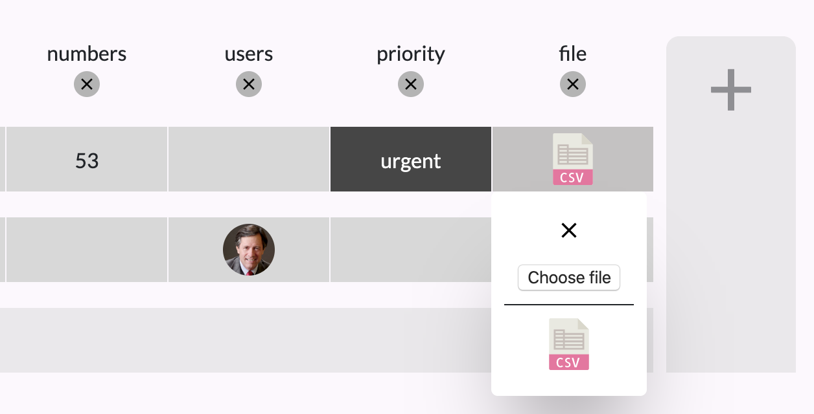

# General Assembly Project 4 - Kaku

[Deployed Project Link](https://j-beehive.herokuapp.com/)

Kaku was my fourth project at General Assembly. This project was done solo and was my first time at building a full stack web application with Python and Django. This Project was done over one week.

## Task Brief

* **Build a full-stack application**
* **Use an Django and Python for the back end**
* **Use PostgreSQL for databasing**
* **Implement thoughtful user stories**
* **Be deployed online**

## Technologies Used

* JavaScript (ES6)
* HTML5
* CSS3
* React.js
* Python
* Django
* PostgreSQL
* Axios
* Git
* GitHub
* Insomnia
* Sketch
* Cloudinary

## Installation

* Clone or download the repo
* In the frontend directory install all of project the dependencies with `yarn` 
* In the project root run the commands 
  * `pip install pipenv`
  * `pipenv install django==2.2.9`
  * `pipenv shell`
  * `pipenv install psycopg2-binary`
  * `createdb tuesday`
  * `python manage.py migrate`
  * `python manage.py runserver`
* Open your chosen browser and navigate to `http://localhost:8000/`

## Overview
Having been inspired by the outrageous number of Monday.com adverts on the internet, when time came to start thinking about the basis for this project, I already had the idea to do a similar table-based project management system. I decided to work alone for this project because I wanted to get the experience of doing every aspect of the project, front and back end. I also wanted to challenge myself as much as possible and I knew that the back end database relationships and logic were going to be very tricky whereas on the front end the layout and functionality were going to be very difficult to implement.

# Walkthrough

## Login/Register Page
The Landing page is the first page non logged-in users see. Any invalid requests for login and register come back with errors that get displayed in red text next to the respective field. The button just below the form switches between the register and login forms. I also used labels instead of placeholder text on the inputs for improved accessibility.


## Profile Page
The Profile page is visible only to the user logged in and displays their email and username alongside their profile image. The main content of this page is the list of tasks that have been assigned to the user. Every bit of information on the user page is clickable. Upon hovering personal information an edit icon appears and on click the information changes to a pre-populated input field that the user can use to edit their information. Clicking on the user image allows the user to upload a profile image to cloudinary which is then set as their profile picture. Finally the user can also click on the tasks to navigate to that project.


## Project Page
The project screen is where all of the project information is held in a table format. Users are able to navigate to a project's page through the tags on the left panel. Like with the profile page, the project info is editable on click. The final row of the project will always be a 'create new' row where on click a user can type in place the task name. The final column will always be a 'create new' column to allow for unlimited customizability. There are also buttons to open a project chat, delete the project or delete a specific column/row. 


## New Column Popup
Adding a new column opens a popup with various options for column content.


## Column Input
Each column type has a unique popup selector, below are some examples




## Comment Board
The Comments page is unique to each project and shared only between projects collaborators. Comments owned by the user are coloured differently and originate from the left side to help differentiate.


## Edit Users
When a user clicks on the user edit section on the project page a modal opens with the ability to search users and add or remove them from the project.


## New Project
The new project page is accessed through the plus tag in the left panel. It allows users to create a new project with a name, description and users. The build your team button brings up the same modal as the one above.


## Extra Functionality
The core functionality of Kaku is based around the customisable table however I wanted to make sure that users had the ability to communicate with each other so one of the final things that I added was the project message board. Taking inspiration from Monday.com I really liked the sleek way that the implemented project editing - by clicking on the piece of information a user wanted to edit - so I made sure to implement a similar system in my application to edit project and user information. 

## Process
After my third project I took a slightly different approach as I realised that it would be impossible to account for every front end need if I were to attempt to build the entire back end before starting on the front end.

1. The first half a day was spent thinking about back end models and relationships. I planned as much of the back end as I could and then started the Django setup.
2. I then wireframed and prototyped some designs for the front end in sketch.
3. My next step was to get started on the back end. I spent about a day and a half building models, views and serializers and used Insomnia to test my end points.
4. Once the basic functionality of the back end was set up I attached a react front end with create react app.
5. I then worked on building the front end functionality and design.
6. Whenever I would reach a point where I needed some extra functionality in the back end I would switch over and build them side by side. This meant that for the most part the functionality of my back end was dependent on front end needs.


I used Trello throughout the process as my project management tool. At the very start of the project I added most of the main aspects of the project that needed to be done and then throughout the days if I felt that they needed to split into smaller tasks I would do so. 


# Reflections

## Featured Code

One of the most important aspects of the whole project was customisable columns and rows for the projects. Whilst the rows were relatively easy to visualise and create in a database as just a many to one relationship with the project, the columns were a lot more difficult to conceptualise as they have a far more complex relationship involving the project and rows, the different types of data in the column etc. Though I did not have enough time to try and figure out the most effective solution I am happy with the one I came up with. The column model itself is actually only one field that gets attached to each row of a project but with an non-unique ID that increments and identifies the column field as part of a column. 

The code below firstly executes some checks to make sure that the user is logged in and part of the project, thus allowed to add a column. It then loops through the tasks in the project and adds a column field with the same column id to each one. Finally it saves the project and increments the column id.

```python
class ColumnListView(APIView):

    permission_classes = (IsAuthenticated, )

    def post(self, request, pk):
        try:
            project = Project.objects.get(pk=pk)
            if request.user not in project.users.all():
                return Response({'message': 'Unauthorized'}, status=HTTP_401_UNAUTHORIZED)
            tasks = project.tasks.all()
            for task in tasks:
                request.data['task'] = task.id
                request.data['col_id'] = Column.COL_ID
                column = ColumnSerializer(data=request.data)
                print(column)
                if column.is_valid():
                    column.save()
                else: 
                    return Response(column.errors, status=HTTP_422_UNPROCESSABLE_ENTITY)
            serialized_project = PopulatedProjectSerializer(project)
            Column.COL_ID += 1
            print(Column.COL_ID)
            return Response(serialized_project.data, status=HTTP_201_CREATED)
        except Project.DoesNotExist:
            return Response({'message': 'Not Found'}, status=HTTP_404_NOT_FOUND)
}
```

## Wins
I am very happy with how the whole project came out. As I anticipated, the customisable table approach ended up being very difficult to conceptualise in the back end and equally difficult to implement in the front end due to the number of moving parts. Despite this however I think it all came together well. I am very glad with how well the back end tasks and columns models work. Many of the front end elements took some time to figure out but ended up working well. One such element was the unique column inputs and how I got them to appear in the correct location, which required some event target x and y scroll value maths. I am also proud of other small but simple things that improve the user experience such as the file icon in the column changing depending on the type of file uploaded which changes the class of a div by splitting the file path by its dots and returning the final segment:
```jsx
{column.col_type === 'file' && 
column[column.col_type] && 
<div className={`column_file_icon pointer_events_none column_file_${column[column.col_type].split('.').pop()}`}></div>}
```

## Challenges
Whilst most aspects of the project were challenging and pushed me, due to the nature of my column implementation I ran into a couple of unexpected issues such as adding a new row after a column had already been added to the project. I realised that in doing this, the row would be created with no columns attached. I managed to get around this with the code below, where I loop through the first row on the project and save the same columns that it again but with a relationship to the new task.
```python
def post(self, request, pk):
    request.data['project'] = pk
    task = TaskSerializer(data=request.data)
    if task.is_valid():
        project = Project.objects.get(pk=pk)
        if request.user not in project.users.all():
            return Response({'message': 'Unauthorized'}, status=HTTP_401_UNAUTHORIZED)
        task.save()
        project = Project.objects.get(pk=pk)
        serialized_project = PopulatedProjectTaskSerializer(project)
        print(serialized_project.data['tasks'][0]['columns'])
        for column in serialized_project.data['tasks'][0]['columns']:
            col = {}
            col['col_type'] = column['col_type']
            col['col_id'] = column['col_id']
            col['task'] = task.data['id']
            serialized_column = ColumnSerializer(data=col)
            if serialized_column.is_valid():
                serialized_column.save()
        serialized_project = ProjectSerializer(project)
        return Response(serialized_project.data, status=HTTP_201_CREATED)
    return Response(task.errors, status=HTTP_422_UNPROCESSABLE_ENTITY)
```
Due to the unique nature of the column types it was also a challenge to create customised popups for their inputs as they all required different information to be successfully sent and saved to the back end.

## What Next
Were I to have more time on this project there are a number of features that I think would improve the experience however I think the most important things would be the following:

* Changing much of the behind the scenes functionality of the front end so allow for smaller data requests to the back end.
* The ability to drag, rearrange and order the projects in the side panel.
* Assigning colours to each task and grouping them.
* Improved column display - they currently show the raw data in the database
* Seperate column name and type in the user model so the user can edit them
* Allow for multiple users to be assigned to a task - already implemented in the back end.
* Column input redesign.
* Add more column types.
* Add join project requests.

## Key Learnings

Doing my final project solo really helped to give me a better understanding of all aspects of a web application. building a Django back end on my own and then doing the same with a react front end really helped to reinforce the skills that the project was supposed to exercise. I think one of my main takeaways from the project was how difficult it can be to visualise database relationships and so how important it is to plan them well. Similarly learning how important it is to manage the amount of data being requested and sent to an application's back end is something that this project opened my eyes to.